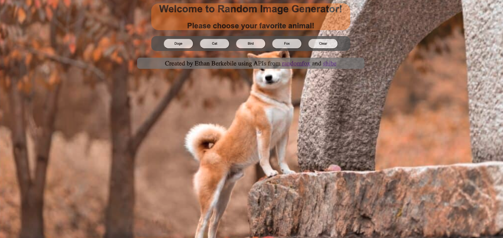

````markdown
# Random Animal Pictures

## Overview

https://wow-suchdoge.surge.sh/

This simple web application allows users to generate random pictures and facts of their favorite animals. Users can choose from Doge, Cat, Bird, and Fox categories. The application is built using HTML, CSS, JavaScript, and jQuery. Random images and facts are fetched from external APIs.



## Features

- **Animal Selection**: Users can choose from Doge, Cat, Bird, and Fox categories.
- **Sound Effects**: Each animal category comes with a unique sound effect.
- **Random Images and Facts**: Fetches random images and facts about the selected animal.

## Technologies Used

- **HTML:** Used for structuring the content and elements of the web pages.
- **CSS:** Responsible for styling and layout of the web pages.
- **JavaScript:** The primary programming language for the client-side application logic.
- **jQuery:** Used for simplified AJAX requests to fetch data from external APIs.

## How to Run

1. Clone the repository to your local machine.

   ```bash
   git clone https://github.com/ethanberke/random-animal-pictures
   ```
````

2. Open the `index.html` file in a web browser.

## Usage

- Click on the buttons to select your favorite animal category.
- Enjoy the sound effect and view the random image and facts about the selected animal.

## Credits

- Animal images and facts are fetched from [randomfox.ca](https://randomfox.ca/) and [shibe.online](https://shibe.online/).

## Contact

For any inquiries or feedback, please contact Ethan Berkebile via email at [ethanberkebile@gmail.com].

**Thank you for exploring Random Animal Pictures!** 🐾

```

```
